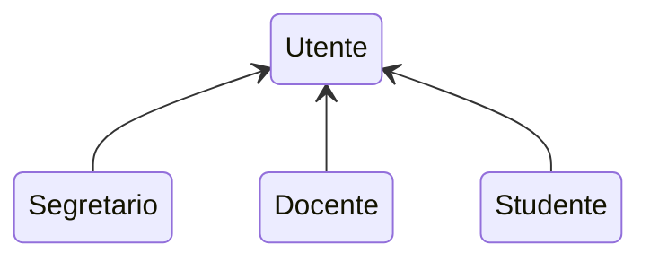
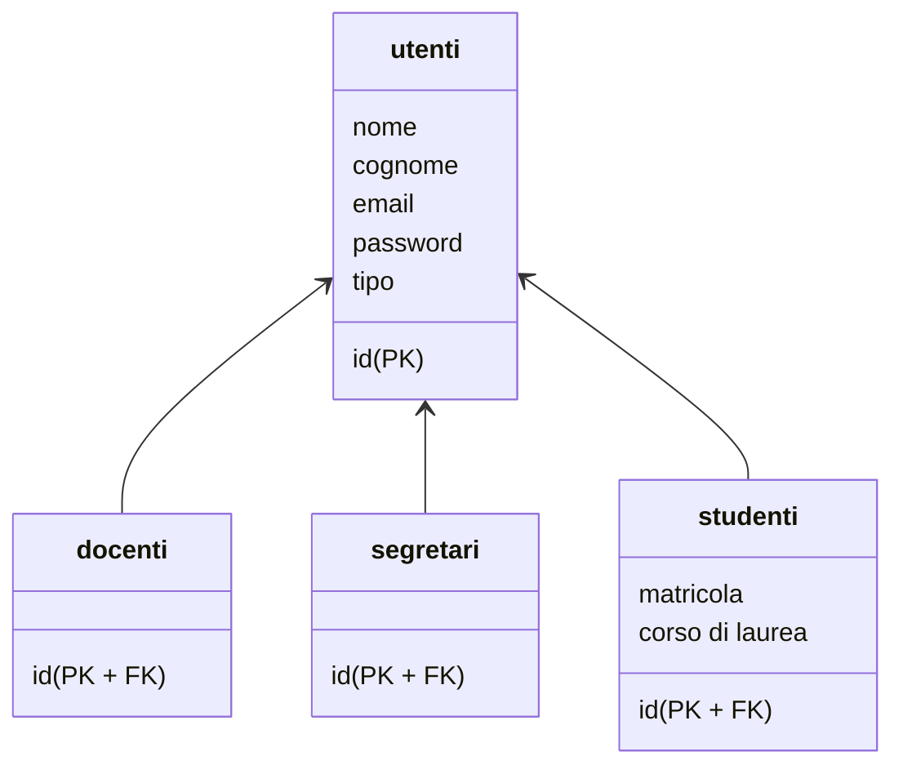

## Documentazione Tecnica

Relazione del progetto _"Piattaforma per la gestione degli esami universitari"_ (in breve _"Unimia"_ o _"SuperUnimia"_) per il corso _"Basi di dati"_ (a.a. 2022-2023, appello di Settembre).

Realizzata da Luca Favini (matricola 987617).

- [Testing e Deploy](#testing-e-deploy)
- [Struttura del progetto](#struttura-del-progetto)
  - [Stack tecnologico](#stack-tecnologico)
  - [Organizzazione del codice](#organizzazione-del-codice)
- [Database](#database)
  - [Schema ER](#schema-er)
  - [Schema Logico](#schema-logico)
- [Scelte implementative significative](#scelte-implementative-significative)
  - [Ristrutturazione database](#ristrutturazione-database)
  - [Campo identificativo utenti: uuid](#campo-identificativo-utenti-uuid)
  - [Hashing delle password: estensione `pgcrypto`](#hashing-delle-password-estensione-pgcrypto)
  - [Generazione email utente e matricola studente](#generazione-email-utente-e-matricola-studente)
  - [(Non) aggiornamento: COALESCE](#non-aggiornamento-coalesce)
  - [Propedeuticità cicliche: trigger di controllo ricorsivo](#propedeuticità-cicliche-trigger-di-controllo-ricorsivo)
  - [Carriera valida](#carriera-valida)
  - [Archivio: laurea e rinuncia agli studi](#archivio-laurea-e-rinuncia-agli-studi)
  - [Componenti PHP](#componenti-php)
  - [Funzionamento componenti PHP](#funzionamento-componenti-php)
  - [Meccanismo di login e controllo permessi](#meccanismo-di-login-e-controllo-permessi)
  - [Generazione AJAX insegnamenti per propedeuticità](#generazione-ajax-insegnamenti-per-propedeuticità)
  - [Componente filtro tabelle](#componente-filtro-tabelle)
- [Descrizione funzioni realizzate](#descrizione-funzioni-realizzate)
  - [Procedure](#procedure)
  - [Funzioni](#funzioni)
  - [Trigger](#trigger)

## Testing e Deploy

Per informazioni riguardo l'installazione e l'avvio del software si rimanda al [manuale utente](MANUALE_UTENTE.md).

Il software è anche disponibile all'**indirizzo web** [superunimia.favo02.dev](https://superunimia.favo02.dev).\
Ogni **modifica** _pushata_ al [repository GitHub](https://github.com/Favo02/super-unimia) scatena un **aggiornamento automatico** della versione disponibile online, attraverso una **GitHub action**.

## Struttura del progetto

### Stack tecnologico

- Postgres (database)
- PHP _+ HTML, CSS, JavaScript_ (webapp)
- _Docker + Github Actions (deploy)_

### Organizzazione del codice

Ogni cartella alla root del progetto include una parte indipendente del progetto:

- `database`: script sql per la creazione e popolazione del **database**
- `webapp`: cartella contentente tutti i file PHP per la realizzazione della **webapp**
  - `components`: **componenti** _(molto grezzi)_ riutilizzabili tra varie pagine PHP
  - `docente`: pagine accessibili dagli utenti di tipo **docente**
  - `scripts`: vari script di utilità _(login, controllo autorizzazioni, connessione al database, ...)_
  - `segretario`: pagine accessibili dagli utenti di tipo **segretario**
  - `studente`: pagine accessibili dagli utenti di tipo **studente**
  - `styles`: stili CSS
- _`docs`: documentazione_
- _`.github`: GitHub actions per il deploy_
- _`deploy`: file Docker per il deploy_

## Database

### Schema ER

Lo schema ER è disponibile come immagine al link: [Schema ER](https://github.com/Favo02-unimi/super-unimia/tree/main/docs/ER_schema.png).\
_La parte a bassa opacità della schema ER rappresenta l'archivio._

### Schema logico

Lo schema logico è disponibile come immagine al link: [Schema logico](https://github.com/Favo02-unimi/super-unimia/tree/main/docs/Logic_schema.png).

## Scelte implementative significative

- [Ristrutturazione database](#ristrutturazione-database)
- [Campo identificativo utenti: uuid](#campo-identificativo-utenti-uuid)
- [Hashing delle password: estensione `pgcrypto`](#hashing-delle-password-estensione-pgcrypto)
- [Generazione email utente e matricola studente](#generazione-email-utente-e-matricola-studente)
- [(Non) aggiornamento: COALESCE](#non-aggiornamento-coalesce)
- [Propedeuticità cicliche: trigger di controllo ricorsivo](#propedeuticità-cicliche-trigger-di-controllo-ricorsivo)
- [Carriera valida](#carriera-valida)
- [Archivio: laurea e rinuncia agli studi](#archivio-laurea-e-rinuncia-agli-studi)
- [Componenti PHP](#componenti-php)
- [Funzionamento componenti PHP](#funzionamento-componenti-php)
- [Meccanismo di login e controllo permessi](#meccanismo-di-login-e-controllo-permessi)
- [Generazione AJAX insegnamenti per propedeuticità](#generazione-ajax-insegnamenti-per-propedeuticità)
- [Componente filtro tabelle](#componente-filtro-tabelle)

### Ristrutturazione database

Lo schema ER presenta una gerarchia tra l'**entità padre** utente e le **entità figlie** segretario, docente e studente.\
Ho deciso di ristrutturare questa gerarchia aggiungendo delle **relazioni** tra utente e i figli, in modo da mantenere delle **informazioni comuni** dentro la tabella padre ma poter aggiungere delle **informazioni aggiuntive** dentro le tabelle figlie (segretari, docenti, studenti, archivio studenti).



Nello specifico, la tabella utenti contiene le informazioni comuni a tutti gli utenti: _Nome_, _Cognome_, _Email_, _Password_ e _Tipo di utente_. Questo permette di semplificare il meccanismo di login: qualsiasi sia il tipo di utente la query verrà **sempre eseguita sulla tabella utenti**, che contiene sia email che password, quindi tutte le informazioni utili al login.

Ma non avrebbe avuto senso mantenere **solo la tabella utenti** (con eventuali informazioni aggiuntive con campi **_null-able_**), questa soluzione avrebbe permesso di avere foreign key specifiche di un tipo di utente **possibili su tutti i tipi**.\
Ad esempio la foreign key per stabilire il _responsabile_ di un _insegnamento_ direttamente sulla tabella utenti avrebbe portato alla possibilità di avere uno _studente_ o un _segretario_ responsabile di un insegnamento (quindi sarebbero stati necessari ulteriori controlli attraverso trigger).

Di conseguenza la soluzione attraverso relazione: tutte le operazioni sull'utenza (login, cambio password) sono comuni sulla tabella **utenti**, mentre le relazioni specifiche di un tipo sfruttano le tabelle figlie, ovvero **segretari**, **docenti**, **studenti**. In questo modo non ci sono problemi di tipi di utenti sbagliati, non ci saranno studenti responsabili di corsi o segretari iscritti ad esami (grazie alle foreign key).

Questa soluzione si porta con sè un problema relativo alla **specifica traccia** di questo esame: la tabella **studenti** come **informazioni aggiuntive** ha _matricola_ e _corso di laurea_, ma i **segretari** e i **docenti** che informazioni aggiuntive hanno oltre a quelle già memorizzate in utenti?\
Allo scopo della realizzazione del mondo della traccia proposta **nessuna**. Sono tabelle con **solamente una chiave esterna** per estrarre un **sottoinsieme di utenti** che hanno dei compiti e diritti specifici.\
Ma basta espandere un minimo gli orizzonti e si potrebbe affidare al docente un ufficio e al segretario un numero di telefono pubblico o degli orari di ricevimento.

_Credo, quindi, che questa sia la migliore soluzione: tutti gli **utenti in comune**, ma poi **raggruppati in sottoinsiemi** in base al tipo, anche a costo di tabelle con solo chiave esterna._



### Campo identificativo utenti: `uuid`

Ogni utente è identificato dal suo `id` (primary key). La colonna id è di tipo **uuid** (Universally Unique IDentifier), ovvero un tipo di dato **univoco** ma **non incremental**e.

Ho deciso di non utilizza un classico `serial` per ragioni di sicurezza _(e banalmente di best practice)_: non dovrebbe essere possibile per un utente generico **risalire** ad id di altri utenti (tantomeno semplicemente incrementando o diminuendo il proprio id).\
Sebbene risalire ad un id non dovrebbe di per sè essere un rischio per la sicurezza dato che viene sempre passato alle query l'id **salvato in sessione PHP** (quindi sul server) e non quello **ricevuto dal client** (quindi manomissibile), ritengo sia una best practice non permettere all'utente finale di risalire ad informazioni di altri utenti.

### Hashing delle password: estensione `pgcrypto`

Le password degli utenti non sono _ovviamente_ salvate in chiaro, ma vengono "**hashate**" e "**saltate**" all'inserimento, attraverso l'utilizzo della funzione `crypt` dell'estensione di postgres `pgcrypto`. Questa estensione implementa funzioni aggiornate allo stato dell'arte, che non utilizzando algoritmi non sicuri come SHA-1 o MD-5.

```sql
INSERT INTO utenti(password, nome, cognome, tipo)
VALUES (crypt(_password, gen_salt('bf')), INITCAP(_nome), INITCAP(_cognome), 'studente'),
```

### Generazione email utente e matricola studente

La mail di un utente non viene inserita "a mano" alla creazione, ma viene **generata automaticamente** attraverso un **trigger** all'inserimento di un nuovo utente, basandosi sul suo nome, cognome e tipo. Vengono inoltre considerati eventuali **omonimi**, aggiungendo un numero per evitare duplicazioni.

```sql
SELECT count(*) INTO _num
FROM utenti AS u
WHERE u.email LIKE CONCAT(LOWER(NEW.nome), '.', LOWER(NEW.cognome), '%');

IF _num = 0 THEN
  NEW.email := CONCAT(LOWER(NEW.nome), '.', LOWER(NEW.cognome), '@', NEW.tipo, '.superuni.it');
ELSE
  NEW.email := CONCAT(LOWER(NEW.nome), '.', LOWER(NEW.cognome), _num, '@', NEW.tipo, '.superuni.it');
END if;

RETURN NEW;
```

Un meccanismo molto simile è utilizzato per la **matricola dello studente**. Viene generato un numero di 6 cifre fino a quanto non ne viene generato uno che non sia già in uso.

```sql
LOOP
  _matricola := floor(random() * (999999 - 100000 + 1) + 100000)::CHAR(6);

  IF NOT EXISTS (
    SELECT matricola FROM studenti WHERE matricola = _matricola
  ) THEN
    NEW.matricola := _matricola;
    EXIT;
  END IF;
END LOOP;

RETURN NEW;
```

### (Non) aggiornamento: COALESCE

Tutte le procedure di modifica del database sono implementate per fare in modo che un campo **lasciato vuoto non venga aggiornato**. Per fare ciò sfruttano la funzione `COALESCE`: il risultato della funzione è il primo parametro non-null passato ad essa.

```sql
UPDATE utenti SET
  nome = INITCAP(COALESCE(NULLIF(_nome, ''), nome)),
  cognome = INITCAP(COALESCE(NULLIF(_cognome, ''), cognome)),
  email = LOWER(COALESCE(NULLIF(_email, ''), email))
WHERE id = _id;
```

Questo dettaglio porta a due grossi vantaggi in termini di usabilità:

- non devono esistere **diverse funzioni** per aggiornare solo **parzialmente** i dati di una tabelle
- non vanno inseriti **tutti i dati** se si vuole aggiornare solo un campo (basterà lasciare gli altri vuoti) 

### Propedeuticità cicliche: trigger di controllo ricorsivo

Un problema delle propedeuticità è la possibilità di creare **cicli di propedeuticità**, ad esempio l'_insegnamento 1_ che richiede l'_insegnamento 2_ come propedeutico, ma anche il contrario. In caso siano presenti cicli, lo studente non si può iscrivere ad alcun insegnamento, rendendo **impossibile** il completamento del percorso di studi.

Per prevenire ciò ho implementato un **trigger di controllo ricorsivo**: all'inserimento di una propedeuticità (ad esempio _INS1_ propedeutico a _INS2_) vengono selezionati tutti gli insegnamenti propedeutici all'insegnamento propedeutico (_INS1_) e viene controllato che non esista l'altro insegnamento della nuova propedeuticità (_INS2_).

```sql
IF NEW.insegnamento_propedeutico = NEW.insegnamento THEN
  raise exception 'È presente una propedeuticità ciclica';
END IF;

WITH RECURSIVE propedeutici AS (
    -- non-recursive term
    SELECT p.insegnamento_propedeutico
    FROM propedeuticita AS p
    WHERE insegnamento = NEW.insegnamento_propedeutico
  UNION
    -- recursive term
    SELECT p2.insegnamento_propedeutico
    FROM propedeutici AS p
    INNER JOIN propedeuticita AS p2 ON p.insegnamento_propedeutico = p2.insegnamento
)
SELECT count(*) INTO _c FROM propedeutici AS p
WHERE p.insegnamento_propedeutico = NEW.insegnamento;

IF _c > 0 THEN
  raise exception 'È presente una propedeuticità ciclica';
END IF;
```

### Carriera valida

Ogni valutazione di uno studente è **valida** solo se è **sufficiente** (>= 18) e non sono presenti iscrizioni ad **appelli più recenti**. Verificare se una valutazione è valida è necessario per produrre la **carriera valida** (e la media).\
Questo risultato è ottenuto prima di tutto controllando che il voto sia presente e che sia sufficiente e poi che non esistano iscrizioni ad appelli diversi con data maggiore (più recente) rispetto alla valutazione da controllare _(subquery)_.

```sql
SELECT isc.appello, a.insegnamento, i.nome, a.data,
  i.responsabile, CONCAT(udoc.nome, ' ', udoc.cognome),
  isc.studente, CONCAT(ustu.nome, ' ', ustu.cognome), s.matricola,
  isc.voto,
  (
    CASE
      -- voto in attesa o insufficiente
      WHEN (isc.voto IS NULL) OR (isc.voto < 18) THEN false
      -- voto sovrascritto da appello più recente
      WHEN EXISTS (
        SELECT *
        FROM iscrizioni AS isc2
        INNER JOIN appelli a2 on isc2.appello = a2.codice
        WHERE isc2.studente = isc.studente
        AND a2.insegnamento = a.insegnamento
        AND a2.data > a.data
        AND Now() > a2.data
      ) THEN false
      ELSE true
    END
  ) as valida
FROM iscrizioni AS isc
INNER JOIN appelli AS a ON a.codice = isc.appello
INNER JOIN insegnamenti i ON a.insegnamento = i.codice
INNER JOIN utenti AS udoc ON udoc.id = i.responsabile
INNER JOIN utenti AS ustu ON ustu.id = isc.studente
INNER JOIN studenti AS s ON s.id = isc.studente
WHERE Now() > a.data
ORDER BY isc.studente, i.codice, a.data;
```

### Archivio: laurea e rinuncia agli studi

Quando uno studente viene eliminato, le sue informazioni vengono **spostare nell'archivio** (attraverso l'utilizzo di un trigger). Il trigger deve anche stabilire la **motivazione dell'archiviazione**: lo studente si è _laureato_ o ha _rinunciato agli studi_.

La motivazione assume il valore _"Laurea"_ in caso lo studente abbia superato **tutti gli esami**, ovvero esiste una valutazione **attiva** per ogni esame del suo corso di laurea, assume valore _"Rinuncia agli studi"_ altrimenti.

Una volta stabilita la motivazione il trigger procedere a spostare lo **studente** e le sue **valutazioni** nell'archivio.

```sql
SELECT count(*) INTO _esami_mancanti
FROM get_esami_mancanti_per_studente(OLD.id);

IF _esami_mancanti > 0 THEN
  _motivazione := 'Rinuncia agli studi';
ELSE
  _motivazione := 'Laurea';
END IF;

INSERT INTO archivio_studenti
VALUES (OLD.id, OLD.matricola, OLD.corso_di_laurea, _motivazione);

WITH old_iscrizioni AS (
  DELETE FROM iscrizioni AS isc
  WHERE isc.studente = OLD.id
  RETURNING isc.*
)
INSERT INTO archivio_iscrizioni SELECT * FROM old_iscrizioni;

UPDATE utenti SET tipo = 'ex_studente' WHERE id = OLD.id;

RETURN OLD;
```

Il trigger si serve della funzione `esami_mancanti`, la quale non fa altro che restituire gli esami del corso di laurea dello studente che **non presentano** una valutazione attiva.

```sql
SELECT i.codice, i.nome, i.descrizione, i.anno,
  i.responsabile, CONCAT(doc.nome, ' ', doc.cognome), doc.email,
  string_agg(insegnamento_propedeutico, ', ')
FROM studenti AS s
INNER JOIN insegnamenti AS i ON i.corso_di_laurea = s.corso_di_laurea
LEFT JOIN propedeuticita AS p ON p.insegnamento = i.codice
INNER JOIN utenti AS doc ON doc.id = i.responsabile
WHERE s.id = _id
AND NOT EXISTS (
  -- non esiste valutazione
  SELECT *
  FROM iscrizioni AS isc
  INNER JOIN appelli AS a ON a.codice = isc.appello
  WHERE isc.studente = _id
  AND a.insegnamento = i.codice
  AND isc.voto IS NOT NULL
  AND isc.voto >= 18
  AND NOT EXISTS (
    -- che non è stata sovrascritta più recentemente
    SELECT *
    FROM iscrizioni AS isc2
    INNER JOIN appelli AS a2 ON a2.codice = isc2.appello
    WHERE isc2.studente = _id
    AND a2.insegnamento = a.insegnamento
    AND a2.data > a.data
    AND Now() > a2.data
  )
)
GROUP BY i.codice, i.nome, i.descrizione, i.anno,
  i.responsabile, CONCAT(doc.nome, ' ', doc.cognome), doc.email
ORDER BY i.corso_di_laurea, i.anno, i.codice;
```

### Componenti PHP

La grande maggioranza del sito web è composta da pagine racchiudibili in due categorie: pagine contenenti una **lista di dati** (tabella) e pagine contenenti un **form** di modifica/inserimento dati, per questo motivo ho realizzato dei **"componenti"** custom in modo da minimizzare il **codice ripetuto** per l'implementazione di queste pagine simili tra loro.

Per creare una pagina utilizzando un componente è necessario dichiarare le **variabili richieste** dal componente (i parametri che esso utilizzerà) e poi **includere** il componente stesso.

```php
$title = "Gestione appelli";
$fa_icon = "fa-calendar-day";
$subtitle = "Appelli degli insegnamenti del tuo corso di laurea.";
// ...
require("../components/table.php");
```

Grazie a questo semplice meccanismo il numero di **codice ripetuto** è molto **limitato**, lo **sviluppo** di nuove pagine è **semplificato** e lo **stile** è **uniforme**.

### Funzionamento componenti PHP

Il componente tabella (`table`) riceve, oltre che una lista di informazioni standard come titolo e icona, una lista di dati da visualizzare (nella variable `rows`). \
Il componente scorre tutte le righe e ne visualizza il contentuo per ciascuna.

```php
<?php foreach($rows as $row): ?> // per ogni riga
  <tr class="<?= $row["class"] ?>"> // crea table row (tr)
    <?php foreach($row["cols"] as $td): ?> // scorre tutte le celle della riga
      <td><?= $td["val"] ?></td> // inserisce cella: table data (td) 
    <?php endforeach ?>
  </tr>
<?php endforeach ?>
```

Il componente tabella deve anche essere in grado di generare celle che siano dei pulsanti (ad esempio i tasti modifica ed elimina), all'interno di una riga.\
Per questo motivo il componente controlla il campo **tipo del dato ricevuto**, in modo da generare del codice **HTML diverso** in base allo scopo della cella.

```php
<?php if ($td["type"] == "text"): ?> // tipo testo
  // ...
<?php endif ?>
<?php if ($td["type"] == "button"): ?> // tipo pulsante
  // ...
<?php endif ?>
```

Un meccanismo paragonabile è stato utilizzato anche per il componente form, che in base al tipo di input da visualizzare genera codice HTML per input `text`, `number`, `date`, `time`, `select`, `multiple select`.

### Meccanismo di login e controllo permessi

I permessi all'interno della webapp sono gestiti tramite **sessioni PHP** (`$_SESSION`). Ogni pagina della webapp (escuso il login) include uno **script di utilità** chiamato `redirector.php`, che non fa altro che verificare il tipo di utente e **reindirizzarlo** nella pagina corretta, impedendo l'accesso a pagine protette.

```php
<?php
// manca il login, redirect a login
if (!isset($_SESSION["userid"])) {
  Redirect("../index.php");
}
// se la pagina attuale ($CUR_PAGE) non corrisponde al tipo di utente,
// reindirizzare alla sua home
if ((!isset($CUR_PAGE)) || $_SESSION["usertype"] != $CUR_PAGE) {
  switch ($_SESSION["usertype"]) {
  case "studente":
    Redirect("../studente/home.php");
  case "ex_studente":
    Redirect("../ex_studente/home.php");
  case "docente":
    Redirect("../docente/home.php");
  case "segretario":
    Redirect("../segretario/home.php");
  }
}
?>
```

Queste variabili di sessione vengono impostate dalla **pagina login**, che effettua una **interrogazione al database** passando email e password. In caso l'interrogazione abbia successo allora le variabili di sessione `userid` (id dell'utente) e `usertype` (tipo dell'utente) saranno impostate, altrimenti visualizza un messaggio d'errore.

### Generazione AJAX insegnamenti per propedeuticità

È possibile modificare le **propedeuticità** nelle pagine di **creazione e modifica** di un insegnamento. Questo porta con sè un problema: devono venir visualizzati solo gli insegnamenti dello **stesso corso di laurea** dell'insegnamento stesso. Ma è possibile modificare il corso di laurea nella stessa pagina, necessitando un **aggiornamento asincrono**.

Per risolvere questo piccolo problema **senza** aggiungere pagine intermedie confusionarie ho implementato una semplice **richiesta AJAX**, che aggiorna gli insegnamenti disponibili ad essere aggiunti alle propedeuticità ogni volta che viene **cambiato** il corso di laurea.

```js
function generaInsegnamenti(cdl) {
  document.querySelector("select[name='propedeuticita[]']").innerHTML
    = "<option>Loading...</option>";

  var xmlhttp = new XMLHttpRequest();
  xmlhttp.onreadystatechange = function() {
    if (this.readyState == 4 && this.status == 200) {
      document.querySelector("select[name='propedeuticita[]']").innerHTML
        = this.responseText;
    }
  };
  xmlhttp.open("GET", `ajax_insegnamenti.php?cdl=${cdl}`, true);
  xmlhttp.send();
}
```

### Componente filtro tabelle

Tutte le pagine che contengono una tabella hanno anche a disposizione un **filtro**, che permette appunto di filtrare e/o evidenziare i risultati della tabella in base ad un **parametro di ricerca**.

Il parametro di ricerca è salvato come **parametro GET** della pagina, questo permette di creare dei **link che attivano il filtraggio** della pagina. Questo meccanismo è spesso utilizzato per mostrare solo i dati relativi ad un **pulsante di reindirizzamento** che è stato premuto, risparmiando la creazione pagine più dettagliate ma semplicemente **filtrando quella generica**.\
La funzione di ricerca è scritta in JavaScript ed è solamente **lato frontend**.

```js
function filterTable() {
  const dom = [...document.querySelectorAll("tbody > tr")]
  // ...
  dom.forEach(tr => {
    if (highlight) {
      if (tr.textContent.toLowerCase().includes(target)) {
        tr.classList.add("focused")
      }
    }
    if (hide) {
      if (!tr.textContent.toLowerCase().includes(target)) {
        tr.classList.add("hidden")
      }
    }
  })
}
```

## Descrizione funzioni realizzate

- [Procedure](#procedure)
- [Funzioni](#funzioni)
- [Trigger](#trigger)

### Procedure

- `new_studente`: Crea un nuovo studente dato nome, cognome e password
- `edit_studente`: Modifica uno studente dato il suo id (non vengono aggiornati i campi lasciati a NULL)
- `delete_studente`: Elimina uno studente dato il suo id (spostandolo nell'archivio grazie al trigger)
- `new_docente`: Crea un nuovo docente dato nome, cognome e password
- `edit_docente`: Modifica un docente dato il suo id (non vengono aggiornati i campi lasciati a NULL)
- `delete_docente`: Elimina un docente dato il suo id (l'utente non viene cancellato in caso siano presenti foreing key)
- `edit_user_password`: Modifica la password di un utente (data solo la mail, senza controlli, quindi per un admin)
- `edit_password`: Modifica la password di un utente (dato l'id e la vecchia password, quindi per utenti semplici)
- `new_corso_di_laurea`: Crea un nuovo corso di laurea
- `edit_corso_di_laurea`: Modifica un corso di laurea dato il suo codice (non vengono aggiornati i campi lasciati a NULL)
- `delete_corso_di_laurea`: Elimina un corso di laurea dato il suo codice (il cdl non viene cancellato in caso siano presenti foreing key)
- `new_insegnamento`: Crea un nuovo insegnamento
- `edit_insegnamento`: Modifica un insegnamento dato il suo codice (non vengono aggiornati i campi lasciati a NULL)
- `delete_insegnamento`: Elimina un insegnamento dato il suo codice (l'insegnamento non viene cancellato in caso siano presenti foreing key)
- `new_appello`: Crea un appello
- `edit_appello`: Modifica un appello dato il suo codice
- `delete_appello`: Elimina un appello dato il suo codice (l'appello non viene cancellato in caso siano presenti foreing key)
- `iscriviti_appello`: Iscrive uno studente ad un appello
- `disiscriviti_appello`: Disiscrive uno studente ad un appello
- `valuta_iscrizione`: Valuta uno studente iscritto ad un appello

### Funzioni

- `login`: Verifica il login di un utente in base a email e password
- `get_studenti`: Restituisce tutti gli studenti disponibili
- `get_ex_studenti`: Restituisce tutti gli ex studenti disponibili
- `get_studente`: Restituisce uno studente in base al suo ID
- `get_ex_studente`: Restituisce un ex studente in base al suo ID
- `get_docenti`: Restituisce tutti i professori (docenti) disponibili
- `get_docente`: Restituisce un professore (docente) in base al suo ID
- `get_segretari`: Restituisce tutte le segretarie (segretari) disponibili
- `get_segretario`: Restituisce una segretaria (segretario) in base al suo ID
- `get_corsi_di_laurea`: Restituisce tutti i corsi di laurea disponibili
- `get_insegnamenti`: Restituisce tutti gli insegnamenti disponibili
- `get_insegnamenti_per_corso_di_laurea`: Restituisce tutti gli insegnamenti per un corso di laurea specifico
- `get_appelli`: Restituisce tutte le sessioni d'esame (appelli) disponibili
- `get_iscrizioni`: Restituisce tutte le iscrizioni disponibili
- `get_valutazioni`: Restituisce tutte le valutazioni e i registri accademici
- `get_ex_valutazioni`: Restituisce tutte le valutazioni e i registri accademici per gli ex studenti
- `get_esami_mancanti`: Restituisce gli esami mancanti per tutti gli studenti
- `get_insegnamenti_per_docente`: Restituisce tutti gli insegnamenti per i quali un professore è responsabile
- `get_appelli_per_docente`: Restituisce tutte le sessioni d'esame per le quali un professore è responsabile
- `get_iscrizioni_per_docente`: Restituisce tutte le iscrizioni per le quali un professore è responsabile
- `get_valutazioni_per_docente`: Restituisce tutte le valutazioni date da un professore
- `get_appelli_per_studente`: Restituisce tutte le sessioni d'esame per il corso di studio di uno studente
- `get_media_per_studente`: Restituisce la media delle valutazioni attive per uno studente
- `get_valutazioni_per_studente`: Restituisce tutte le valutazioni per uno studente
- `get_esami_mancanti_per_studente`: Restituisce gli esami mancanti per uno studente

### Trigger

- `genera_mail`: Genera la mail dell'utente basandosi su nome, cognome, tipo e omonimi
- `genera_matricola`: Genera la matricola dello studente (controllando eventuali duplicati)
- `controllo_anno_insegnamento`: Controlla, alla creazione di un nuovo insegnamento, che l'anno sia compatibile con il tipo di laurea
- `controllo_numero_insegnamenti_per_docente`: Controlla, alla creazione o aggiornamento di un nuovo insegnamento, che il docente responsabile non abbia già 3 insegnamenti
- `controllo_propedeuticita_cicliche`: Controlla che le propedeuticità non siano cicliche durante la creazione o l'aggiornamento delle propedeuticità per un insegnamento
- `controllo_appelli_per_anno`: Controlla che non esistano più appelli dello stesso corso di laurea nella stessa giornata
- `controllo_propedeuticita_iscrizione`: Controlla che le propedeuticità siano rispettate quando uno studente si iscrive a un appello
- `archivia_studente`: Sposta uno studente e le sue iscrizioni nell'archivio alla cancellazione, con una motivazione di "Rinuncia agli studi" o "Laurea"
